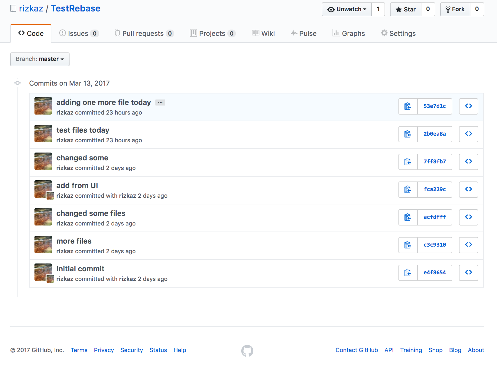

Git Cheat Sheet
---------------

### Stash 

Stash changes (save changes to files in a stash for later use)

> `git stash`

Apply stashed changes to files in working directory

> `git stash apply`

Useful command options:

    # show stashed changes
    git stash show
    
    # list stashed changes
    git stash list
    
Examples from stash man page
    
    Pulling into a dirty tree
       When you are in the middle of something, you learn that there are upstream changes that are possibly relevant to what you are doing. When your local changes do not conflict with the changes in the upstream, a simple git pull will let
       you move forward.
    
       However, there are cases in which your local changes do conflict with the upstream changes, and git pull refuses to overwrite your changes. In such a case, you can stash your changes away, perform a pull, and then unstash, like this:
    
       $ git pull
        ...
       file foobar not up to date, cannot merge.
       $ git stash
       $ git pull
       $ git stash pop

    Interrupted workflow
        When you are in the middle of something, your boss comes in and demands that you fix something immediately. Traditionally, you would make a commit to a temporary branch to store your changes away, and return to your original branch to
        make the emergency fix, like this:
        
        # ... hack hack hack ...
        $ git checkout -b my_wip
        $ git commit -a -m "WIP"
        $ git checkout master
        $ edit emergency fix
        $ git commit -a -m "Fix in a hurry"
        $ git checkout my_wip
        $ git reset --soft HEAD^
        # ... continue hacking ...
        
        You can use git stash to simplify the above, like this:
        
        # ... hack hack hack ...
        $ git stash
        $ edit emergency fix
        $ git commit -a -m "Fix in a hurry"
        $ git stash pop
        # ... continue hacking ...
        
    Testing partial commits
        You can use git stash save --keep-index when you want to make two or more commits out of the changes in the work tree, and you want to test each change before committing:
    
        # ... hack hack hack ...
        $ git add --patch foo            # add just first part to the index
        $ git stash save --keep-index    # save all other changes to the stash
        $ edit/build/test first part
        $ git commit -m 'First part'     # commit fully tested change
        $ git stash pop                  # prepare to work on all other changes
        # ... repeat above five steps until one commit remains ...
        $ edit/build/test remaining parts
        $ git commit foo -m 'Remaining parts'

### Add files to be committed (stage files to local index from workspace)

> `git add <filename>`

Useful command options:

    # interactive mode
    git add -i
    
    
    
### Remove/Delete files

> `git rm <filename>`

### Commit files that are staged (commit staged files to local repository)

> `git commit -m "message for this commit"`

### Push to remote

default push location is `origin`

> `git push`

Useful command options:

    # dry run
    -n or --dry-run
    
    # set upstreasm
    -u --set-upstream

Examples from man page

    git push
       Works like git push <remote>, where <remote> is the current branch's remote (or origin, if no remote is
       configured for the current branch).

    git push origin
       Without additional configuration, pushes the current branch to the configured upstream (remote.origin.merge
       configuration variable) if it has the same name as the current branch, and errors out without pushing
       otherwise.
    
       The default behavior of this command when no <refspec> is given can be configured by setting the push option of
       the remote, or the push.default configuration variable.
    
       For example, to default to pushing only the current branch to origin use git config remote.origin.push HEAD.
       Any valid <refspec> (like the ones in the examples below) can be configured as the default for git push origin.
    
    git push origin :
       Push "matching" branches to origin. See <refspec> in the OPTIONS section above for a description of "matching"
       branches.
    
    git push origin master
       Find a ref that matches master in the source repository (most likely, it would find refs/heads/master), and
       update the same ref (e.g.  refs/heads/master) in origin repository with it. If master did not exist remotely,
       it would be created.
    
    git push origin HEAD
       A handy way to push the current branch to the same name on the remote.
    
    git push origin HEAD:master
       Push the current branch to the remote ref matching master in the origin repository. This form is convenient to
       push the current branch without thinking about its local name.
    
    git push origin master:refs/heads/experimental
       Create the branch experimental in the origin repository by copying the current master branch. This form is only
       needed to create a new branch or tag in the remote repository when the local name and the remote name are
       different; otherwise, the ref name on its own will work.
    
    git push origin :experimental
       Find a ref that matches experimental in the origin repository (e.g.  refs/heads/experimental), and delete it.

### Pull from a repository AND merge to another

The default of this command is (git fetch + git merge FETCH_HEAD)

> `git pull`

### Fetch from remote (and merge later - fetch only)

> `git fetch`

### Git logs

one line output

> `git log --oneline`

    97f223e fix link
    439cde7 Update LICENSE
    06c8815 Set theme jekyll-theme-cayman
    c4c042b add documentation
    5bf1a01 adding more files
    b9f24a4 new files now
    1d0bf3c adding one more file today
    2b0ea8a test files today
    7ff8fb7 changed some
    fca229c add from UI
    acfdfff changed some files
    c3c9310 more files
    e4f8654 Initial commit

detailed output

> `git log`

    commit 97f223e6159c979851698ae64dc8f57cff6e7df4
    Author: Saira <rizkaz@users.noreply.github.com>
    Date:   Tue Mar 14 15:36:15 2017 -0400
    
        fix link
    
    commit 439cde79b53f0b1b55e3871fb33af0ad92a25ba1
    Author: UserName <username@users.noreply.github.com>
    Date:   Tue Mar 14 15:31:32 2017 -0400
    
        Update LICENSE
    
    
    #
    # extra output removed for readability
    #
    ...
    
    
    commit e4f86540387557cc14e08d255841d54ef4c29322
    Author: UserName <username@users.noreply.github.com>
    Date:   Sun Mar 12 10:05:27 2017 -0400
    
        Initial commit

##### For pretty printing log

Display color coded log information with tree view

> `alias gitlog='git log --all --graph --pretty=format:'"'"'%Cred%h%Creset -%C(auto)%d%Creset %s %Cgreen(%cr) %C(bold blue)<%an>%Creset'"'"' --date=relative --abbrev-commit'`

    gitlog
    * 97f223e - (HEAD -> master, origin/master, origin/HEAD) fix link (7 days ago) <Saira>
    * 439cde7 - Update LICENSE (7 days ago) <Saira>
    * 06c8815 - Set theme jekyll-theme-cayman (7 days ago) <Saira>
    * c4c042b - add documentation (7 days ago) <rizkaz>
    | *   72b316e - (refs/stash) WIP on master: 5bf1a01 adding more files (7 days ago) <rizkaz>
    | |\  
    |/ /  
    | * 91cb1cb - index on master: 5bf1a01 adding more files (7 days ago) <rizkaz>
    |/  
    * 5bf1a01 - adding more files (8 days ago) <rizkaz>
    * b9f24a4 - new files now (8 days ago) <rizkaz>
    * 1d0bf3c - adding one more file today (8 days ago) <rizkaz>
    * 2b0ea8a - test files today (8 days ago) <rizkaz>
    * 7ff8fb7 - changed some (8 days ago) <rizkaz>
    * fca229c - add from UI (8 days ago) <Saira>
    * acfdfff - changed some files (8 days ago) <rizkaz>
    * c3c9310 - more files (8 days ago) <rizkaz>
    * e4f8654 - Initial commit (8 days ago) <Saira>

Pretty Print Code Snippet: [reference](https://coderwall.com/p/euwpig/a-better-git-log)

Display details 

> `gitlog -p`

Display file statistics for commits

> `gitlog --stat`

Limit display to the last n commits only

> `gitlog -n`

#### Pretty Print Log Stats `gitlog --stat -2`

### Git diff

diff a file

> `git diff <filename>`

    git diff test.sh
    diff --git a/test.sh b/test.sh
    index 1e0eaec..09c1000 100644
    --- a/test.sh
    +++ b/test.sh
    @@ -1 +1,2 @@
    +#!/usr/bin/env bash
     add new file

See the changes in last push.

> `git diff HEAD^ HEAD`

    diff --git a/README.md b/README.md
    index fe1c5ff..b57deed 100644
    --- a/README.md
    +++ b/README.md
    @@ -288,12 +288,12 @@ Commit logs on Github
     
     New logs
     
    -
    +
     
     
     Old logs 
     
    -
    +
     
Git diff, display the name status only

> `git diff --name-status`
    
    M       GitCheatSheet.md
    M       test.sh

> `git diff HEAD --summary`

    create mode 100644 GitCheatSheet.md
    
### Make changes to commit history

Change commit history all the way up the root in interactive mode.

> `git rebase --root -i`

change history to commit number <commit> in interactive mode

> `git rebase <commit> -i`

### Reset file status

Reset current HEAD to the specified state
 
Default: Without losing data (OPPOSITE OF ADD)

> `git reset <filename>`

In this form, the reset command resets the current branch head to <commit> and updates the index to point to the <commit> point.
Working tree is changed depending on <mode>, default is --mixed mode.

> `git reset <mode> <commit>`

Details from git reset man pages

    --soft
        Does not touch the index file or the working tree at all (but resets the head to <commit>, just like all modes do). This leaves all your
        changed files "Changes to be committed", as git status would put it.
    
    --mixed
        Resets the index but not the working tree (i.e., the changed files are preserved but not marked for commit) and reports what has not been
        updated. This is the default action.
    
        If -N is specified, removed paths are marked as intent-to-add (see git-add(1)).
    
    --hard
        Resets the index and working tree. Any changes to tracked files in the working tree since <commit> are discarded.
    
    --merge
        Resets the index and updates the files in the working tree that are different between <commit> and HEAD, but keeps those which are different
        between the index and working tree (i.e. which have changes which have not been added). If a file that is different between <commit> and the
        index has unstaged changes, reset is aborted.
    
        In other words, --merge does something like a git read-tree -u -m <commit>, but carries forward unmerged index entries.
    
    --keep
        Resets index entries and updates files in the working tree that are different between <commit> and HEAD. If a file that is different between
        <commit> and HEAD has local changes, reset is aborted.

EXAMPLES from man page

Undo add

    $ edit                                     (1)
    $ git add frotz.c filfre.c
    $ mailx                                    (2)
    $ git reset                                (3)
    $ git pull git://info.example.com/ nitfol  (4)

    1. You are happily working on something, and find the changes in these files are in good order. You do not want to see them when you run "git
    diff", because you plan to work on other files and changes with these files are distracting.
    2. Somebody asks you to pull, and the changes sounds worthy of merging.
    3. However, you already dirtied the index (i.e. your index does not match the HEAD commit). But you know the pull you are going to make does not
    affect frotz.c or filfre.c, so you revert the index changes for these two files. Your changes in working tree remain there.
    4. Then you can pull and merge, leaving frotz.c and filfre.c changes still in the working tree.

Undo a commit and redo

    $ git commit ...
    $ git reset --soft HEAD^      (1)
    $ edit                        (2)
    $ git commit -a -c ORIG_HEAD  (3)
    
    1. This is most often done when you remembered what you just committed is incomplete, or you misspelled your commit message, or both. Leaves
    working tree as it was before "reset".
    2. Make corrections to working tree files.
    3. "reset" copies the old head to .git/ORIG_HEAD; redo the commit by starting with its log message. If you do not need to edit the message further,
    you can give -C option instead.
    
    See also the --amend option to git-commit(1).

Undo a commit, making it a topic branch

    $ git branch topic/wip     (1)
    $ git reset --hard HEAD~3  (2)
    $ git checkout topic/wip   (3)
    
    1. You have made some commits, but realize they were premature to be in the "master" branch. You want to continue polishing them in a topic branch,
    so create "topic/wip" branch off of the current HEAD.
    2. Rewind the master branch to get rid of those three commits.
    3. Switch to "topic/wip" branch and keep working.

Undo commits permanently

    $ git commit ...
    $ git reset --hard HEAD~3   (1)
    
    1. The last three commits (HEAD, HEAD^, and HEAD~2) were bad and you do not want to ever see them again. Do not do this if you have already given
    these commits to somebody else. (See the "RECOVERING FROM UPSTREAM REBASE" section in git-rebase(1) for the implications of doing so.)

Undo a merge or pull

    $ git pull                         (1)
    Auto-merging nitfol
    CONFLICT (content): Merge conflict in nitfol
    Automatic merge failed; fix conflicts and then commit the result.
    $ git reset --hard                 (2)
    $ git pull . topic/branch          (3)
    Updating from 41223... to 13134...
    Fast-forward
    $ git reset --hard ORIG_HEAD       (4)
    
    1. Try to update from the upstream resulted in a lot of conflicts; you were not ready to spend a lot of time merging right now, so you decide to do
    that later.
    2. "pull" has not made merge commit, so "git reset --hard" which is a synonym for "git reset --hard HEAD" clears the mess from the index file and
    the working tree.
    3. Merge a topic branch into the current branch, which resulted in a fast-forward.
    4. But you decided that the topic branch is not ready for public consumption yet. "pull" or "merge" always leaves the original tip of the current
    branch in ORIG_HEAD, so resetting hard to it brings your index file and the working tree back to that state, and resets the tip of the branch to
    that commit.

Undo a merge or pull inside a dirty working tree

    $ git pull                         (1)
    Auto-merging nitfol
    Merge made by recursive.
    nitfol                |   20 +++++----
    ...
    $ git reset --merge ORIG_HEAD      (2)
    
    1. Even if you may have local modifications in your working tree, you can safely say "git pull" when you know that the change in the other branch
    does not overlap with them.
    2. After inspecting the result of the merge, you may find that the change in the other branch is unsatisfactory. Running "git reset --hard
    ORIG_HEAD" will let you go back to where you were, but it will discard your local changes, which you do not want. "git reset --merge" keeps your
    local changes.

Interrupted workflow

Suppose you are interrupted by an urgent fix request while you are in the middle of a large change. 
The files in your working tree are not in any shape to be committed yet, but you need to get to the other branch for a quick bugfix.

    $ git checkout feature ;# you were working in "feature" branch and
    $ work work work       ;# got interrupted
    $ git commit -a -m "snapshot WIP"                 (1)
    $ git checkout master
    $ fix fix fix
    $ git commit ;# commit with real log
    $ git checkout feature
    $ git reset --soft HEAD^ ;# go back to WIP state  (2)
    $ git reset                                       (3)
    
    1. This commit will get blown away so a throw-away log message is OK.
    2. This removes the WIP commit from the commit history, and sets your working tree to the state just before you made that snapshot.
    3. At this point the index file still has all the WIP changes you committed as snapshot WIP. This updates the index to show your WIP files as
    uncommitted.

           
Reset a single file in the index

Suppose you have added a file to your index, but later decide you do not want to add it to your commit. You can remove the file from the index
while keeping your changes with git reset.
    
    $ git reset -- frotz.c                      (1)
    $ git commit -m "Commit files in index"     (2)
    $ git add frotz.c                           (3)
    
    1. This removes the file from the index while keeping it in the working directory.
    2. This commits all other changes in the index.
    3. Adds the file to the index again.

Keep changes in working tree while discarding some previous commits
Suppose you are working on something and you commit it, and then you continue working a bit more, but now you think that what you have in your
working tree should be in another branch that has nothing to do with what you committed previously. You can start a new branch and reset it while
keeping the changes in your working tree.

    $ git tag start
    $ git checkout -b branch1
    $ edit
    $ git commit ...                            (1)
    $ edit
    $ git checkout -b branch2                   (2)
    $ git reset --keep start                    (3)
    
    1. This commits your first edits in branch1.
    2. In the ideal world, you could have realized that the earlier commit did not belong to the new topic when you created and switched to branch2
    (i.e. "git checkout -b branch2 start"), but nobody is perfect.
    3. But you can use "reset --keep" to remove the unwanted commit after you switched to "branch2".

DISCUSSION

    The tables below show what happens when running:
    
       git reset --option target
    
    to reset the HEAD to another commit (target) with the different reset options depending on the state of the files.
    
    In these tables, A, B, C and D are some different states of a file. For example, the first line of the first table means that if a file is in state A
    in the working tree, in state B in the index, in state C in HEAD and in state D in the target, then "git reset --soft target" will leave the file in
    the working tree in state A and in the index in state B. It resets (i.e. moves) the HEAD (i.e. the tip of the current branch, if you are on one) to
    "target" (which has the file in state D).
    
       working index HEAD target         working index HEAD
       ----------------------------------------------------
        A       B     C    D     --soft   A       B     D
                                 --mixed  A       D     D
                                 --hard   D       D     D
                                 --merge (disallowed)
                                 --keep  (disallowed)
    
       working index HEAD target         working index HEAD
       ----------------------------------------------------
        A       B     C    C     --soft   A       B     C
                                 --mixed  A       C     C
                                 --hard   C       C     C
                                 --merge (disallowed)
                                 --keep   A       C     C
    
       working index HEAD target         working index HEAD
       ----------------------------------------------------
        B       B     C    D     --soft   B       B     D
                                 --mixed  B       D     D
                                 --hard   D       D     D
                                 --merge  D       D     D
                                 --keep  (disallowed)
    
       working index HEAD target         working index HEAD
       ----------------------------------------------------
        B       B     C    C     --soft   B       B     C
                                 --mixed  B       C     C
                                 --hard   C       C     C
                                 --merge  C       C     C
                                 --keep   B       C     C
    
       working index HEAD target         working index HEAD
       ----------------------------------------------------
        B       C     C    D     --soft   B       C     D
                                 --mixed  B       D     D
                                 --hard   D       D     D
                                 --merge (disallowed)
                                 --keep  (disallowed)
    
       working index HEAD target         working index HEAD
       ----------------------------------------------------
        B       C     C    C     --soft   B       C     C
                                 --mixed  B       C     C
                                 --hard   C       C     C
                                 --merge  B       C     C
                                 --keep   B       C     C

    "reset --merge" is meant to be used when resetting out of a conflicted merge. Any mergy operation guarantees that the working tree file that is
    involved in the merge does not have local change wrt the index before it starts, and that it writes the result out to the working tree. So if we see
    some difference between the index and the target and also between the index and the working tree, then it means that we are not resetting out from a
    state that a mergy operation left after failing with a conflict. That is why we disallow --merge option in this case.
    
    "reset --keep" is meant to be used when removing some of the last commits in the current branch while keeping changes in the working tree. If there
    could be conflicts between the changes in the commit we want to remove and the changes in the working tree we want to keep, the reset is disallowed.
    That's why it is disallowed if there are both changes between the working tree and HEAD, and between HEAD and the target. To be safe, it is also
    disallowed when there are unmerged entries.

    The following tables show what happens when there are unmerged entries:
    
       working index HEAD target         working index HEAD
       ----------------------------------------------------
        X       U     A    B     --soft  (disallowed)
                                 --mixed  X       B     B
                                 --hard   B       B     B
                                 --merge  B       B     B
                                 --keep  (disallowed)
    
       working index HEAD target         working index HEAD
       ----------------------------------------------------
        X       U     A    A     --soft  (disallowed)
                                 --mixed  X       A     A
                                 --hard   A       A     A
                                 --merge  A       A     A
                                 --keep  (disallowed)
    
    X means any state and U means an unmerged index.

### git file status

> `git ls-files <option>`

    # others
    git ls-files -o
    
    # cached
    git ls-files -c
    
    # deleted
    git ls-files -d
    
    # staged
    git ls-files -s
    
    # modified
    git ls-files -m