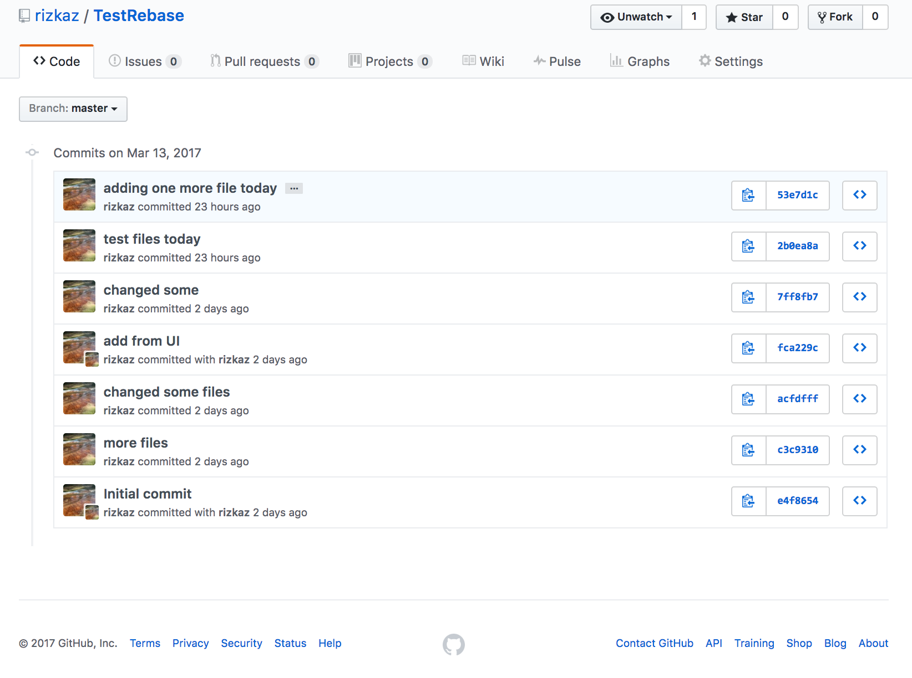
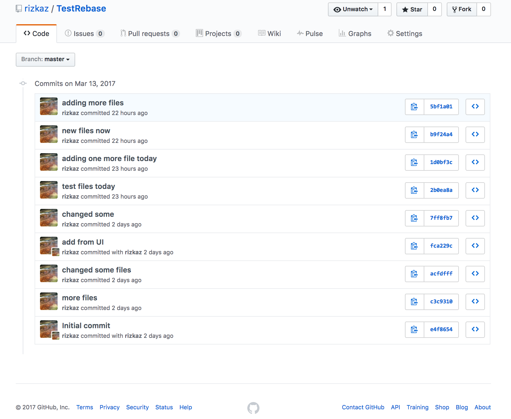

Git Reset and Rebase Commands
=============================

It is possible to change github repository history and logs after making a push containing unnecessary files, for example:
 
* large files
* temp files/unnecessary files
* files with sensitive information

**WARNING: It is not recommended to change commit history of a shared repository. Doing so will cause problems for other users.** 
[**Link To Git Cheat Sheet**](./GitCheatSheet)

List the commit log

    git log --oneline

        5bf1a01 adding more files
        b9f24a4 new files now
        1d0bf3c adding one more file today
        2b0ea8a test files today
        7ff8fb7 changed some
        fca229c add from UI
        acfdfff changed some files
        c3c9310 more files
        e4f8654 Initial commit
        
    git log 
    
        commit 5bf1a0169e3e168c35d8cb77fc7515a339bdafff
        Author: user <emailuser@gmail.com>
        Date:   Mon Mar 13 15:42:05 2017 -0400
        
            adding more files
        
        commit b9f24a495758987711c414e8a4de050c8cc4485c
        Author: user <emailuser@gmail.com>
        Date:   Mon Mar 13 15:16:51 2017 -0400
        
            new files now
        
        commit 1d0bf3cccd37c489c37fe933e01dac4ba9b74812
        Author: user <emailuser@gmail.com>
        Date:   Mon Mar 13 14:32:03 2017 -0400
        
            adding one more file today
        
        commit 2b0ea8a042abfe21642cdb3d38db32c88a218578
        Author: user <emailuser@gmail.com>
        Date:   Mon Mar 13 13:59:07 2017 -0400
        
            test files today
        
        commit 7ff8fb714eebcc789613b78aa3b1e1fd4a0730ac
        Author: user <emailuser@gmail.com>
        Date:   Sun Mar 12 10:19:12 2017 -0400
        
            changed some
        
        commit fca229ce5f8fb35ef388eb815902fbf09f951080
        Author: Saira <user@users.noreply.github.com>
        Date:   Sun Mar 12 10:13:16 2017 -0400
        
            add from UI
        
        commit acfdfff86b809a497155c32f85ec4822d5a6031d
        Author: user <emailuser@gmail.com>
        Date:   Sun Mar 12 10:12:19 2017 -0400
        
            changed some files
        
        commit c3c9310ead53262c446bc6fbe9c87429b8b54ecc
        Author: user <emailuser@gmail.com>
        Date:   Sun Mar 12 10:10:24 2017 -0400


Using the git rebase -i (interactive mode), it is possible to edit the commit history for a repository.

    # interactively rebase to a commit <number>
    git rebase 2b0ea8a -i

        pick 1d0bf3c adding one more file today
        pick b9f24a4 new files now
        pick 5bf1a01 adding more files
        
        # Rebase 2b0ea8a..5bf1a01 onto 2b0ea8a (3 command(s))
        #
        # Commands:
        # p, pick = use commit
        # r, reword = use commit, but edit the commit message
        # e, edit = use commit, but stop for amending
        # s, squash = use commit, but meld into previous commit
        # f, fixup = like "squash", but discard this commit's log message
        # x, exec = run command (the rest of the line) using shell
        # d, drop = remove commit
        #
        # These lines can be re-ordered; they are executed from top to bottom.
        #
        # If you remove a line here THAT COMMIT WILL BE LOST.
        #
        # However, if you remove everything, the rebase will be aborted.
        #
        # Note that empty commits are commented out


Change the lines based on what needs to be done

* `pick`      = use this commit as is
* `reword`    = change commit message for this commit
* `edit`      = amend commit (lets you fix/change the commit)
* `squash`    = squash with previous commit - (merge changes with previous commits in history)
* `fixup`     = discard commit log message while squashing
* `exec`      = run shell command (for doing scripted changes to files)
* `drop`      = remove commit from history


For Example, to squash three commits into one, change to:


    pick 1d0bf3c adding one more file today
    squash b9f24a4 new files now
    squash 5bf1a01 adding more files
    
Save and close the editor. 

The commits b9f24a4 5bf1a01 will be squashed into 1d0bf3c.
    
    # Rebase 2b0ea8a..5bf1a01 onto 2b0ea8a (3 command(s))

    pick 1d0bf3c adding one more file today
    squash b9f24a4 new files now
    squash 5bf1a01 adding more files
    
    # Rebase 2b0ea8a..5bf1a01 onto 2b0ea8a (3 command(s))
    # Please enter the commit message for your changes. Lines starting
    # with '#' will be ignored, and an empty message aborts the commit.
    #
    # Date:      Mon Mar 13 14:32:03 2017 -0400
    #
    # interactive rebase in progress; onto 2b0ea8a
    # Last commands done (3 commands done):
    #    squash b9f24a4 new files now
    #    squash 5bf1a01 adding more files
    # No commands remaining.
    # You are currently editing a commit while rebasing branch 'master' on '2b0ea8a'.
    #
    # Changes to be committed:
    #       modified:   .gitignore
    #       new file:   newfileafterchange.txt
    #       new file:   onelastfile.txt


A summary is displayed for rebase after the process is complete.

    [detached HEAD 53e7d1c] adding one more file today
     Date: Mon Mar 13 14:32:03 2017 -0400
     3 files changed, 6 insertions(+)
     create mode 100644 newfileafterchange.txt
     create mode 100644 onelastfile.txt
    Successfully rebased and updated refs/heads/master.

Git status shows that the branch and `origin/master` have diverged. The changes in the local repository are complete.

    git status
    On branch master
    Your branch and 'origin/master' have diverged,
    and have 1 and 3 different commits each, respectively.
      (use "git pull" to merge the remote branch into yours)
    nothing to commit, working directory clean


Git log shows the new commit history log with the squashed commits. One new commit `53e7d1c adding one more file today` has been created.

    git log --oneline
    
        53e7d1c adding one more file today
        
        2b0ea8a test files today
        7ff8fb7 changed some
        fca229c add from UI
        acfdfff changed some files
        c3c9310 more files
        e4f8654 Initial commit
        

When compared to old log: 

    git log --oneline
    
        5bf1a01 adding more files
        b9f24a4 new files now
        1d0bf3c adding one more file today
        
        2b0ea8a test files today
        7ff8fb7 changed some
        fca229c add from UI
        acfdfff changed some files
        c3c9310 more files
        e4f8654 Initial commit

The default commit message for the newly created commit is a combination of the three previous commits. You can edit this message during the process if needed.

    git log
    
        commit 53e7d1c3932b393ab0486697430d87ebbd1eac6d
        Author: author <emailauthor@gmail.com>
        Date:   Mon Mar 13 14:32:03 2017 -0400
        
            adding one more file today
            
            new files now
            
            adding more files
        
        commit 2b0ea8a042abfe21642cdb3d38db32c88a218578
        Author: author <emailauthor@gmail.com>
        Date:   Mon Mar 13 13:59:07 2017 -0400
        
            test files today
        
        commit 7ff8fb714eebcc789613b78aa3b1e1fd4a0730ac
        Author: author <emailauthor@gmail.com>
        Date:   Sun Mar 12 10:19:12 2017 -0400
        
            changed some
        
        commit fca229ce5f8fb35ef388eb815902fbf09f951080
        Author: Saira <author@users.noreply.github.com>
        Date:   Sun Mar 12 10:13:16 2017 -0400
        
            add from UI
        
        commit acfdfff86b809a497155c32f85ec4822d5a6031d
        Author: author <emailauthor@gmail.com>
        Date:   Sun Mar 12 10:12:19 2017 -0400
        
            changed some files
        
        commit c3c9310ead53262c446bc6fbe9c87429b8b54ecc
        Author: author <emailauthor@gmail.com>
        Date:   Sun Mar 12 10:10:24 2017 -0400
        
            more files
        
        commit e4f86540387557cc14e08d255841d54ef4c29322
        Author: Saira <author@users.noreply.github.com>
        Date:   Sun Mar 12 10:05:27 2017 -0400
        
            Initial commit

        
Changes in files from commits `5bf1a01` and `b9f24a4` were squashed and a new commit was created based on selected `pick`.

    squash b9f24a4 new files now 
    squash 5bf1a01 adding more files
    pick 1d0bf3c adding one more file today


If the push was already made to github using the old commit history, then use `--force` to overwrite github master repository history.
 
    git push
        
        To git@github.com:user/TestRebase.git
         ! [rejected]        master -> master (non-fast-forward)
        error: failed to push some refs to 'git@github.com:user/TestRebase.git'
        hint: Updates were rejected because the tip of your current branch is behind
        hint: its remote counterpart. Integrate the remote changes (e.g.
        hint: 'git pull ...') before pushing again.
        hint: See the 'Note about fast-forwards' in 'git push --help' for details.

This will overwrite github master.

    git push --force
    
    push --force
    Counting objects: 5, done.
    Delta compression using up to 4 threads.
    Compressing objects: 100% (3/3), done.
    Writing objects: 100% (5/5), 502 bytes | 0 bytes/s, done.
    Total 5 (delta 2), reused 1 (delta 0)
    remote: Resolving deltas: 100% (2/2), completed with 2 local objects.
    To git@github.com:user/TestRebase.git
     + 5bf1a01...53e7d1c master -> master (forced update)

**THIS SHOULD CHANGE GITHUB REPOSITORY TO 7 COMMIT HISTORY**


Commit logs on Github
---------------------

New logs




Old logs 




To squash/change all commits to the root, use the `--root` flag in `rebase`
---------------------------------------------------------------------------

Interactively change/squash/edit as needed.

```
# interactively rebase to root
git rebase --root -i
```

If you have a branch with old state, it is possible to revert any changes that we made with this force push
-----------------------------------------------------------------------------------------------------------

If the local branch is at `5bf1a0169e3e168c35d8cb77fc7515a339bdafff`, we can overwrite history as needed.


Stash/Save local changes on branch 

    git stash
    Saved working directory and index state WIP on master: 5bf1a01 adding more files
    HEAD is now at 5bf1a01 adding more files

Check the status of commit logs

    git status
    
    On branch master
    Your branch and 'origin/master' have diverged,
    and have 3 and 1 different commits each, respectively.
      (use "git pull" to merge the remote branch into yours)
    nothing to commit, working directory clean

View commit logs
    
    git log --oneline
    
    5bf1a01 adding more files
    b9f24a4 new files now
    1d0bf3c adding one more file today
    2b0ea8a test files today
    7ff8fb7 changed some
    fca229c add from UI
    acfdfff changed some files
    c3c9310 more files
    e4f8654 Initial commit
    
Push to github
    
    git push
    
    To git@github.com:user/TestRebase.git
     ! [rejected]        master -> master (non-fast-forward)
    error: failed to push some refs to 'git@github.com:user/TestRebase.git'
    hint: Updates were rejected because the tip of your current branch is behind
    hint: its remote counterpart. Integrate the remote changes (e.g.
    hint: 'git pull ...') before pushing again.
    hint: See the 'Note about fast-forwards' in 'git push --help' for details.
    
Need `--force` as the histories have diverged

    git push --force
    
    Counting objects: 10, done.
    Delta compression using up to 4 threads.
    Compressing objects: 100% (8/8), done.
    Writing objects: 100% (10/10), 920 bytes | 0 bytes/s, done.
    Total 10 (delta 5), reused 0 (delta 0)
    remote: Resolving deltas: 100% (5/5), completed with 2 local objects.
    To git@github.com:user/TestRebase.git
     + 53e7d1c...5bf1a01 master -> master (forced update)
    

Check status 

    git status
    
    On branch master
    Your branch is up-to-date with 'origin/master'.
    nothing to commit, working directory clean
    
Check commit logs

    git log --oneline

    5bf1a01 adding more files
    b9f24a4 new files now
    1d0bf3c adding one more file today
    2b0ea8a test files today
    7ff8fb7 changed some
    fca229c add from UI
    acfdfff changed some files
    c3c9310 more files
    e4f8654 Initial commit

**THIS SHOULD CHANGE GITHUB REPOSITORY BACK TO 9 COMMIT HISTORY AS BEFORE**


# Appendix


Git patches for new and old history
-----------------------------------


Old commit history

```txt
git diff -c e4f86540387557cc14e08d255841d54ef4c29322 5bf1a0169e3e168c35d8cb77fc7515a339bdafff
diff --git a/.gitignore b/.gitignore
index 32858aa..831026b 100644
--- a/.gitignore
+++ b/.gitignore
@@ -8,5 +8,9 @@
 *.war
 *.ear
 
+.idea/*
+
 # virtual machine crash logs, see http://www.java.com/en/download/help/error_hotspot.xml
 hs_err_pid*
+
+passwords.txt
diff --git a/FileFromGithubUI.md b/FileFromGithubUI.md
new file mode 100644
index 0000000..1f8cd77
--- /dev/null
+++ b/FileFromGithubUI.md
@@ -0,0 +1 @@
+Added from UI.
diff --git a/README.md b/README.md
index b6050e7..48db3f2 100644
--- a/README.md
+++ b/README.md
@@ -1,2 +1,5 @@
 # TestRebase
 test rebase after github push
+
+
+changed second time.
diff --git a/march13file.txt b/march13file.txt
new file mode 100644
index 0000000..32be762
--- /dev/null
+++ b/march13file.txt
@@ -0,0 +1 @@
+Test reset commands on git.
diff --git a/morefiles.txt b/morefiles.txt
new file mode 100644
index 0000000..bb0d932
--- /dev/null
+++ b/morefiles.txt
@@ -0,0 +1,2 @@
+Testing with more changes.
+Changed this file a second time.
diff --git a/newfileafterchange.txt b/newfileafterchange.txt
new file mode 100644
index 0000000..2e497e2
--- /dev/null
+++ b/newfileafterchange.txt
@@ -0,0 +1 @@
+new file after cleanup.
diff --git a/onelastfile.txt b/onelastfile.txt
new file mode 100644
index 0000000..d4a905c
--- /dev/null
+++ b/onelastfile.txt
@@ -0,0 +1 @@
+testing one last file edit
diff --git a/test.sh b/test.sh
new file mode 100644
index 0000000..1e0eaec
--- /dev/null
+++ b/test.sh
@@ -0,0 +1 @@
+add new file
diff --git a/twofiles.txt b/twofiles.txt
new file mode 100644
index 0000000..290c072
--- /dev/null
+++ b/twofiles.txt
@@ -0,0 +1,5 @@
+testing with second file addition. 
+
+Changed this file a second time.
+
+Changed second time.
```

New commit history

```txt
git diff -c e4f86540387557cc14e08d255841d54ef4c29322 53e7d1c3932b393ab0486697430d87ebbd1eac6d
diff --git a/.gitignore b/.gitignore
index 32858aa..831026b 100644
--- a/.gitignore
+++ b/.gitignore
@@ -8,5 +8,9 @@
 *.war
 *.ear
 
+.idea/*
+
 # virtual machine crash logs, see http://www.java.com/en/download/help/error_hotspot.xml
 hs_err_pid*
+
+passwords.txt
diff --git a/FileFromGithubUI.md b/FileFromGithubUI.md
new file mode 100644
index 0000000..1f8cd77
--- /dev/null
+++ b/FileFromGithubUI.md
@@ -0,0 +1 @@
+Added from UI.
diff --git a/README.md b/README.md
index b6050e7..48db3f2 100644
--- a/README.md
+++ b/README.md
@@ -1,2 +1,5 @@
 # TestRebase
 test rebase after github push
+
+
+changed second time.
diff --git a/march13file.txt b/march13file.txt
new file mode 100644
index 0000000..32be762
--- /dev/null
+++ b/march13file.txt
@@ -0,0 +1 @@
+Test reset commands on git.
diff --git a/morefiles.txt b/morefiles.txt
new file mode 100644
index 0000000..bb0d932
--- /dev/null
+++ b/morefiles.txt
@@ -0,0 +1,2 @@
+Testing with more changes.
+Changed this file a second time.
diff --git a/newfileafterchange.txt b/newfileafterchange.txt
new file mode 100644
index 0000000..2e497e2
--- /dev/null
+++ b/newfileafterchange.txt
@@ -0,0 +1 @@
+new file after cleanup.
diff --git a/onelastfile.txt b/onelastfile.txt
new file mode 100644
index 0000000..d4a905c
--- /dev/null
+++ b/onelastfile.txt
@@ -0,0 +1 @@
+testing one last file edit
diff --git a/test.sh b/test.sh
new file mode 100644
index 0000000..1e0eaec
--- /dev/null
+++ b/test.sh
@@ -0,0 +1 @@
+add new file
diff --git a/twofiles.txt b/twofiles.txt
new file mode 100644
index 0000000..290c072
--- /dev/null
+++ b/twofiles.txt
@@ -0,0 +1,5 @@
+testing with second file addition. 
+
+Changed this file a second time.
+
+Changed second time.

```

Useful Git commands
-------------------

list the commit log

```
git log
    
    commit 5bf1a0169e3e168c35d8cb77fc7515a339bdafff
    Author: userid <emailuserid@gmail.com>
    Date:   Mon Mar 13 15:42:05 2017 -0400
    
        adding more files
    
    commit b9f24a495758987711c414e8a4de050c8cc4485c
    Author: userid <emailuserid@gmail.com>
    Date:   Mon Mar 13 15:16:51 2017 -0400
    
        new files now
    
    commit 1d0bf3cccd37c489c37fe933e01dac4ba9b74812
    Author: userid <emailuserid@gmail.com>
    Date:   Mon Mar 13 14:32:03 2017 -0400
    
        adding one more file today
    
    commit 2b0ea8a042abfe21642cdb3d38db32c88a218578
    Author: userid <emailuserid@gmail.com>
    Date:   Mon Mar 13 13:59:07 2017 -0400
    
        test files today
    
    commit 7ff8fb714eebcc789613b78aa3b1e1fd4a0730ac
    Author: userid <emailuserid@gmail.com>
    Date:   Sun Mar 12 10:19:12 2017 -0400
    
        changed some
    
    commit fca229ce5f8fb35ef388eb815902fbf09f951080
    Author: Saira <userid@users.noreply.github.com>
    Date:   Sun Mar 12 10:13:16 2017 -0400
    
        add from UI
    
    commit acfdfff86b809a497155c32f85ec4822d5a6031d
    Author: userid <emailuserid@gmail.com>
    Date:   Sun Mar 12 10:12:19 2017 -0400
    
        changed some files
    
    commit c3c9310ead53262c446bc6fbe9c87429b8b54ecc
    Author: userid <emailuserid@gmail.com>
    Date:   Sun Mar 12 10:10:24 2017 -0400
    
        more files
    
    commit e4f86540387557cc14e08d255841d54ef4c29322
    Author: Saira <userid@users.noreply.github.com>
    Date:   Sun Mar 12 10:05:27 2017 -0400
    
        Initial commit
```   


```
git log --oneline
    
    5bf1a01 adding more files
    b9f24a4 new files now
    1d0bf3c adding one more file today
    2b0ea8a test files today
    7ff8fb7 changed some
    fca229c add from UI
    acfdfff changed some files
    c3c9310 more files
    e4f8654 Initial commit
```


Save local changes

```
# save local changes for later
git stash


# refresh working space with stashed files
git stash apply
```

Reset local changes (**Warning : local changes to any files will be lost**)

```
git reset --hard origin/master
```  
